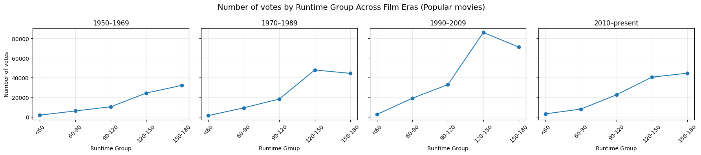
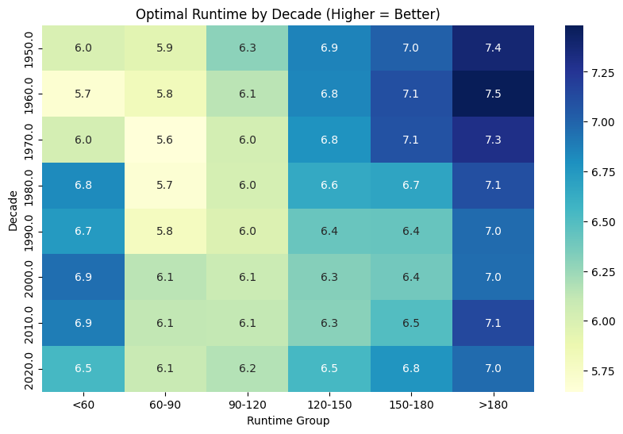
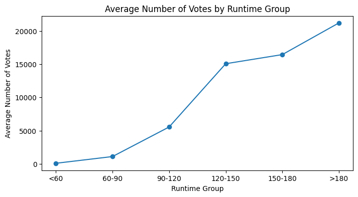
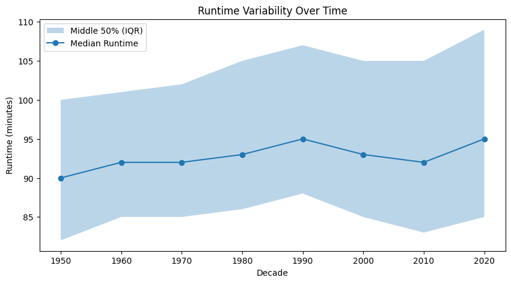

# 🎬 IMDb Movie Data Analysis (EDA Portfolio Project)
## 📌 Project Overview

This project explores trends and patterns in the film industry using the IMDb dataset. Through Exploratory Data Analysis (EDA), the goal is to uncover insights into what drives movie popularity and audience engagement, supporting data-driven decision-making for stakeholders in media, marketing, and investment.

This project demonstrates end-to-end data analytics capabilities—from data cleaning and transformation to visualization and insight generation—using industry-standard tools.

## 🔗 Interactive Report: Open movies_portfolio.html in this repository
## 📓 Notebook: imdb_eda.ipynb

## 🎯 Objectives
* Analyze trends in movie ratings, votes, genres, and runtimes.
* Identify characteristics associated with highly popular and successful films.
* Demonstrate a structured and reproducible EDA workflow.
* Present insights in a clear, business-friendly format suitable for stakeholders.

## 🛠️ Tools & Technologies
| Category        | Tools                       |
| --------------- | --------------------------- |
| Programming     | Python                      |
| Data Analysis   | Pandas, NumPy               |
| Visualization   | Matplotlib, Seaborn, Altair |
| Development     | Jupyter Notebook            |
| Version Control | Git, GitHub                 |

## 📊 Dataset
Source: IMDb (via Kaggle/public dataset)
Key Features:
* Movie title and release year
* Genre and runtime
* IMDb rating
* Number of votes (popularity proxy)

# 📌 This project uses publicly available data for educational and portfolio purposes.
---
## 🔄 Project Workflow
1. Data Cleaning & Preparation
* Handled missing and inconsistent values.
* Converted data types for accurate analysis.
* Engineered features such as runtime groups and film eras.
* Removed duplicates and ensured dataset integrity.

2. Exploratory Data Analysis (EDA)
* Analyzed distributions of ratings, votes, and runtimes.
* Explored relationships between runtime, genre, popularity, and ratings.
* Compared movie performance across different cinematic eras.
* Structured analysis to move from exploration to actionable insight.

3. Visualization & Storytelling
* Developed clear and interpretable visualizations using Altair and Matplotlib.
* Designed visuals to support both technical and non-technical audiences.
* Exported a polished HTML report for professional presentation.

---
## 📈 Key Insights
1. Longer Films Consistently Rate Higher
Across all genres, films in the 150–180 minute and 180+ minute runtime ranges achieve the highest average audience ratings. This suggests that audiences tend to reward films with greater narrative depth and development, though runtime itself is not the causal factor.

2. The 60–90 Minute Runtime is the Danger Zone
The 60–90 minute runtime bracket consistently records the lowest average ratings across nearly all genres. This is the most robust and consistent pattern in the analysis, indicating that films in this range may struggle to meet audience expectations for pacing and depth.

3. Runtime Sensitivity Varies by Genre
The impact of runtime differs significantly across genres:
* Highly sensitive: Horror, Action, and Drama show strong improvements in ratings with longer runtimes.
* Moderately sensitive: Romance and Thriller benefit from extended runtimes.
* Less sensitive: Comedy and Documentary exhibit relatively stable ratings across runtime ranges, suggesting content quality and style play a larger role than duration.

## 🎯 Actionable Recommendations
| Genre       | Avoid             | Target       |
| ----------- | ----------------- | ------------ |
| Action      | 60–90 mins        | 180+ mins    |
| Horror      | 60–90 mins        | 150–180 mins |
| Drama       | 60–90 mins        | 180+ mins    |
| Animation   | Under 90 mins     | 150–180 mins |
| Comedy      | 60–90 mins        | 120+ mins    |
| Documentary | No strong penalty | 180+ mins    |
| Romance     | 60–90 mins        | 150+ mins    |
| Thriller    | 60–90 mins        | 150+ mins    |

## ⚠️ Limitations
* Correlation, Not Causation: Higher ratings for longer films likely reflect factors such as larger budgets, stronger production quality, established directors, and wider releases rather than runtime alone.
* Selection Bias: Longer films are more often major productions with greater visibility and audience reach.
* Data Scope: The analysis focuses on films from 1950 onward and emphasizes standard runtimes (60–180 minutes), which may limit generalizability to short films, experimental cinema, or early film history.
* Votes as a Popularity Proxy: IMDb votes reflect engagement but may be influenced by marketing, distribution, and fan-driven activity.
* Aggregation Effects: Genre and runtime grouping may mask variation within individual films and subgenres.

## 🖼️ Sample Visualizations

---
## 🚀 How to Use This Project
Option 1: Quick View
Download and open: 
* reports/movies_portfolio.html
* presentation/IMDb_Runtime_Analysis_Presentation.pptx

Option 2: Run the Notebook
* git clone https://github.com/your-username/imdb-movie-runtime-analysis.git
* cd imdb-movie-runtime-analysis
* pip install -r requirements.txt
* jupyter notebook